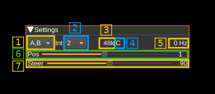
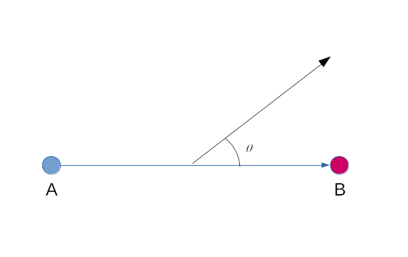

<h1>Beam Steering Continuous Wave plugin</h1>

<h2>Introduction</h2>

This MIMO transmission only (MO) plugin can be used to drive a 2 channel MO device in order to produce a continuous wave signal (CW) with a control of the phase between the two streams. When the MO device is connected to a two antenna system the resulting beam can be steered in direction using the phase difference. Control is made directly in angle units.

; This was designed more as a proof of concept of multiple output plugin rather than something really useful.

<h2>Interface</h2>

The top and bottom bars of the channel window are described [here](../../../sdrgui/channel/readme.md)

<h3>1: Channel output</h3>

The two channels A and B are connected to device output streams 0 and 1 respectively. The device must expose these channels.

Use this combo box to select channel output:
  - **A,B**: output A and B channels
  - **A**: output A channel only
  - **B**: output B channel only

<h3>2: Interpolation factor</h3>

The channel sample rate is interpolated by a power of two to feed the channels at baseband sample rate.

<h3>3: Channel sample rate</h3>

This is the channel sample rate in kilo or mega samples per second indicated by the `k` or `M` letter.

<h3>4: Half-band filter chain sequence display</h3>

This string represents the sequence of half-band filters used in the interpolation from channel to device baseband. Each character represents a filter type:

  - **L**: lower half-band
  - **H**: higher half-band
  - **C**: centered

<h3>5: Center frequency shift</h3>

This is the shift of the channel center frequency from the device center frequency. Its value is driven by the baseband sample rate, the interpolation factor (2) and the filter chain sequence (4).

<h3>6: Half-band filter chain sequence adjust</h3>

The slider moves the channel center frequency roughly from the lower to the higher frequency in the device baseband. The number on the right represents the filter sequence as the decimal value of a base 3 number. Each base 3 digit represents the filter type and its sequence from MSB to LSB in the filter chain:

  - **0**: lower half-band
  - **1**: centered
  - **2**: higher half-band

<h3>7: Steering angle</h3>

This slider controls the beam steering angle &theta; in degrees when the configuration of antennas is made like this:

