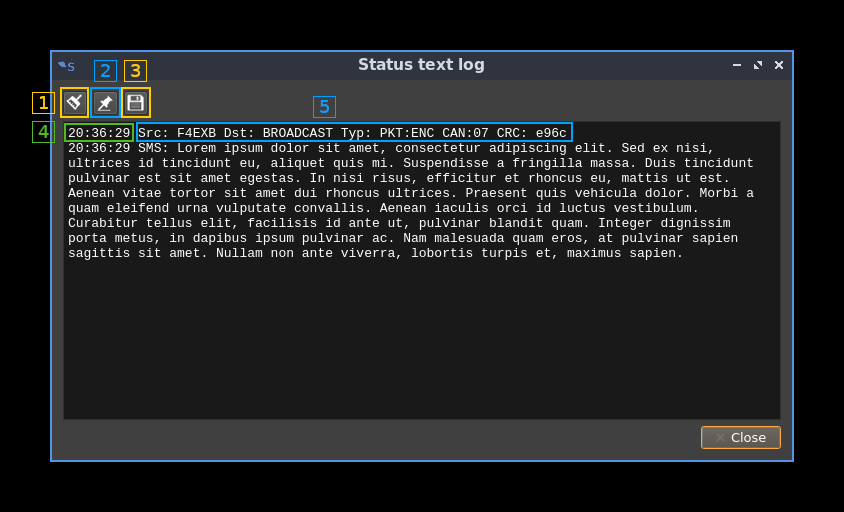
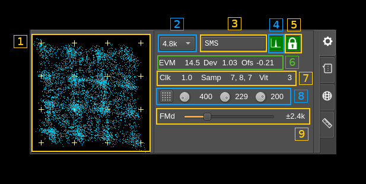
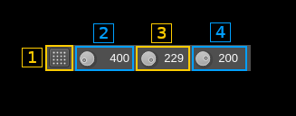
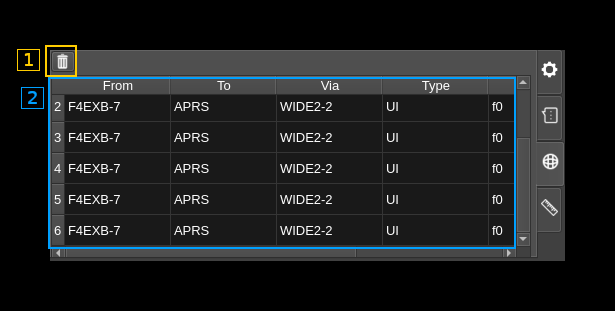
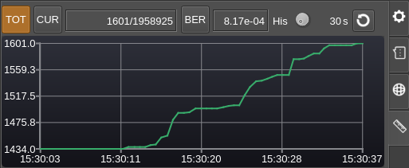
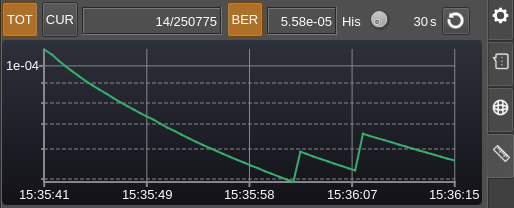
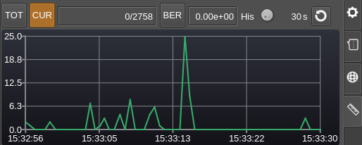
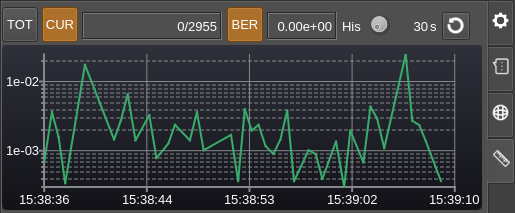

<h1>M17 demodulator</h1>

<h2>Introduction</h2>

This plugin is available only on Linux.

This plugin demodulates and decodes transmissions made in the [M17 protocol](https://spec.m17project.org/) M17 is a fully Open Source and Open Source audio codec based project (Codec2) for FM based digital voice amateur radio. More information is available [here](https://m17project.org/)

<h2>Main interface</h2>

There are 3 main sections

  - **A** General settings: common RF settings analogous to what exists in the DSD demod plugin
  - **B** Digital common: common digital data displays
  - **C** Digital tabs: Four panels are displayed in a tabbed arrangement and each one can be selected by clicking on its corresponding tab on the right. These are from top to bottom:
    - Common digital settings and displays
    - SMS data
    - APRS data
    - BER test data

<h2>A: General settings</h2>

<h3>A.1: Frequency shift from center frequency of reception</h3>

Use the wheels to adjust the frequency shift in Hz from the center frequency of reception. Left click on a digit sets the cursor position at this digit. Right click on a digit sets all digits on the right to zero. This effectively floors value at the digit position. Wheels are moved with the mousewheel while pointing at the wheel or by selecting the wheel with the left mouse click and using the keyboard arrows. Pressing shift simultaneously moves digit by 5 and pressing control moves it by 2.

<h3>A.2: Channel bandwidth before discriminator</h3>

This is the bandwidth of the pre-discriminator filter

<h3>A.3: Channel power</h3>

Total power in dB relative to a &plusmn;1.0 amplitude signal received in the pass band.

<h3>A.4: Channel power bar graph</h3>

This is the same as the one found in many other Rx channels. One should watch that the peaks never exceed the 0dB (right most) mark.

<h3>A.5: Activate status text log</h3>

Check to send the status text to the log. Uncheck to dismiss sending.

<h3>A.6: View status text log</h3>

Click to open a dialog to view the status text lines log:

<h4>A.6.1: Clear log</h4>

Push this button to clear the log

<h4>A.6.2: Pin to last line</h4>

Use this toggle to pin or unpin the log to the last line

<h4>A.6.3: Save log to file</h4>

Save the present log content to a file

<h4>A.6.4: Timestamp</h4>

Each line in the log starts with the timestamp when the status line was fetched from the decoder

<h4>A.6.5: Status text</h4>

One line per status text. SMS or APRS data if applicable is logged next in the same way.

<h3>A.7: Audio volume</h3>

Linear multiplication factor.

<h3>A.8: Squelch level</h3>

The level corresponds to the channel power above which the squelch gate opens.

<h3>A.9: Squelch time gate</h3>

Number of milliseconds following squelch gate opening after which the signal is declared open. There is a delay line for the samples so samples applied to the decoder actually start at the beginning of the gate period not losing any samples. 0 means squelch is declared open with no delay.

<h3>A.10: High-pass filter for audio</h3>

Use this switch to toggle high-pass filter on the audio

<h3>A.11: Audio mute, squelch indicator and select audio output device</h3>

Left click to mute/unmute audio. This button lights in green when the squelch opens.

If you right click on it, it will open a dialog to select the audio output device. See [audio management documentation](../../../sdrgui/audio.md) for details.

<h2>B: Digital common</h2>

<h3>B.1: Source callsign</h3>

Callsign of the emitter

<h3>B.2: Destination callsign</h3>

Callsign of the recipient. When an empty callsign is used it means the transmission is addressed to all stations and "BROADCAST" is shown (as on the screenshot).

<h3>B.3: Type information</h3>

Displays the transmission type information contained in the LSF (Link Setup Frame).

  - First word first part (before colon):
    - **PKT**: Packet
    - **STR**: Stream
  - First word second part (after colon):
    - For packet type:
      - **UNK**: unknown
      - **RAW**: raw packet
      - **ENC**: encapsulated i.e. SMS, APRS...
    - For stream type:
      - **UNK**: unknown
      - **D/D**: all data
      - **V/V**: all voice
      - **V/D**: voice and data mix
  - Channel Access Number: this is a 0..15 code displayed after the **CAN** label

<h3>B.4: LSF CRC</h3>

This is the 16 bit CRC of the Link Setup Frame.

<h3>B.5: Distance to station (QRB)</h3>

This is the distance in kilometers to the remote station from the location that is set as the current station location. This information is updated only if GNSS data is available in the meta section of the LSF. The last valid data is displayed.

<h3>B.6: Bearing to station (QTF)</h3>

This is the bearing in degrees to the remote station from the location that is set as the current station location. This information is updated only if GNSS data s available in the meta section of the LSF. The last valid data is displayed.

<h2>C1: Digital tabs: settings</h2>

This is activated when the tab with the gear icon (top most) is selected.

<h3>C1.1: FM signal scope</h3>

This display shows the sampled points of the demodulated FM signal in a XY plane with X as the instantaneous signal and Y as the signal delayed by the symbol period. This effectively shows symbol transitions with an accumulation of points around the 16 possible transitions which ideal position is represented by small crosshairs.

You can adjust FM deviation and demodulator frequency shift to match positions as closely as possible. The figure normally shows a slanted profile as displayed on the screenshot.

<h3>C1.2: Baud rate</h3>

Symbol rate in Bauds. For now the standard value of 4.8 kBaud is the only possible choice. This is a provision for possible experimentations with protocol derivatives later.

<h3>C1.3: Synchronization status</h3>

Displays the message synchronization data:

  - **Unlocked**: no synchronization
  - **BERT**: BERT frame
  - **Stream**: Stream type frame
  - **Raw**: Packet of raw type
  - **AX.25**: Packet of AX25 type
  - **APRS**: Packet of APRS type
  - **6LoWPAN**: Packet of 6LoWPAN type
  - **IPv4**: Packet of IPv4 type
  - **SMS**: Packet of SMS type
  - **Winlink**: Packet of Winlink type
  - **Unknown**: A synchronization is obtained but is not supported

<h3>C1.4: Data Carrier Detected</h3>

Turns green if DCD status is on

<h3>C1.5: Transmission locked</h3>

Turns green if the Rx clock is locked to the Tx clock

<h3>C1.6: FM discriminator status</h3>

Shows status information on FM discriminator:

  - **EVM**: C4FM symbols Error Vector Magnitude
  - **Dev**: FM deviation factor from ideal. Tune FM deviation to make the value closest to 1.0
  - **Ofs**: FM offset. Ideally should be between -0.15 and 0.15 and closest to 0.0. Tune the demodulator offset to make the value closest to 0.0.

<h3>C1.7: Decoder status</h3>

Shows status information on the decoder:

  - **Clk**: difference between Tx and Rx clocks normalized should be 1.0 when locked
  - **Samp**: sampling point offsets from 0 to 9 as there are 10 samples per symbols at 48 kS/s and 4800 Baud. Numbers are arranged in this order: symbol, sync and clock. The clock offset wins. These numbers should not differ by more than 1 (0 to 9 wrapping considered).
  - **Vit**: Viterbi cost. Should be positive and as low as possible. -1 if unavailable.

<h3>C1.8: FM signal scope controls</h3>

<h4>C1.8.1: Transition constellation or symbol synchronization signal toggle</h4>

For now this is ineffective and only transition constellation is available.

<h4>C1.8.2: Trace length</h4>

This button tunes the length of the trace displayed on C1.1. Units are milliseconds. Default value is 300.

<h4>C1.8.3: Trace stroke</h4>

This button tunes the stroke of the points displayed on C1.1. The trace has limited persistence based on alpha blending. This is the 8 bit unsigned integer value of the trace alpha blending. Default value is 200.

<h4>C1.8.4: Trace decay</h4>

This button tunes the persistence decay of the points displayed on C1.1.1. The trace has limited persistence based on alpha blending. This controls the alpha value of the black screen printed at the end of each trace and thus the trace points decay time. The value is 255 minus the displayed value using 8 bit unsigned integers.

  - A value of 0 yields no persistence
  - A value of 255 yields infinite persistence
  - Default value is 200s

<h3>C1.9: FM deviation</h3>

This is the expected FM deviation. As per M17 standard this should be &plusmn;2.4 kHz. A different value may be used for experimentation with the corresponding deviation on the transmitter side.

<h2>C2: Digital tabs - SMS</h2>

This is activated when the tab with the message chat icon (second from top) is selected and is used to display the content of SMS messages.

<h3>C2.1: Header</h3>

A header is displayed before each message with the timestamp the source and destination calls

<h3>C2.2: Message</h3>

The message contents follows

<h2>C3: Digital tabs - APRS</h2>

This is activated when the tab with the world icon (third from top) is selected and is used to display APRS messages. Note that the M17 demod will connect automatically to the APRS feature and will be displayed in its available sources list.

<h3>C3.1: Clear messages</h3>

Use this button to clear the messages table (C3.2)

<h3>C3.2: Messages table</h3>

This is the APRS messages table similar to the one in the packet demodulator. It has the following columns:

  - **From**: The source address / callsign of the sender of the packet.
  - **To**: The destination address.
  - **Via**: List of addresses of repeaters the packet has passed through or directed via.
  - **Type**: The AX.25 frame type.
  - **PID**: Protocol Identifier.
  - **Data (ASCII)**: The AX.25 information field displayed as ASCII.

<h2>C4: Digital tabs - BERT</h2>

This is activated when the tab with the ruler icon (bottom most) is selected.

BERT stands for Bit Error Rate Testing and is a special mode used to test transmission. The M17 modulator must also be set to BERT mode for the complete setup to work. In this mode there is no link information sent (LSF/LICH) just a synchronization word and a predefined pseudo random sequence that gets synchronized at the receiver. Then the total bits and bits in error are counted.

<h3>C4.1: Total counts</h3>

Toggle total vs current counts (see next)

<h3>C4.2: Current counts</h3>

Toggle current vs total counts. "Current" counts are calculated over a period of about one second. Thus in this mode all numbers are "per second".

<h3>C4.3: Counts</h3>

bits in error / total bits.

<h3>C4.4: BER vs counts diagram</h3>

Select between bit error rate or error count display in the diagram (C4.8)

<h3>C4.5: Bit Error Rate</h3>

This is the ratio between bits in error over total bits.

<h3>C4.6: History length (seconds)</h3>

Sets the maximum number of points displayed in the diagram (C4.8) corresponding to this period of time. The diagram keeps filling until this number is reached then it slides over time.

You can choose between 10 to 3600 seconds in 10 seconds steps with a default of 60 seconds.

<h3>C4.7: Reset BER PRBS</h3>

Resets the pseudo random generator and therefore the counts.

<h3>C4.8: Timeline diagrams</h3>

A diagram with a timeline on the horizontal axis and various data depending on the current data type selected on vertical axis is displayed. If no valid BER data is received the space remains empty.

There are 4 combinations and therefore 4 possible diagrams:

<h4>Total error counts display</h4>

<h4>Total BER display</h4>

As expected the values decay with time if no more errors are received. Note that in BER mode the vertical axis has a logarithmic scale which is more convenient for BER values. The minor ticks are set at tenths of the major ticks intervals

<h4>Current error counts display</h4>

<h4>Current BER display</h4>

As this is a logarithmic scale zero values are skipped.

