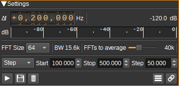
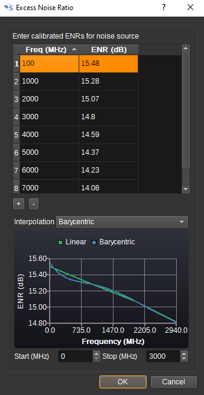
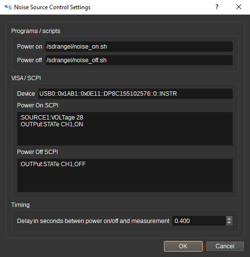
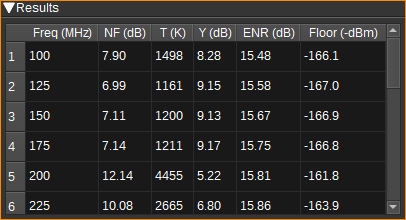
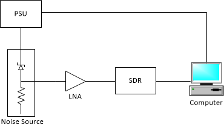
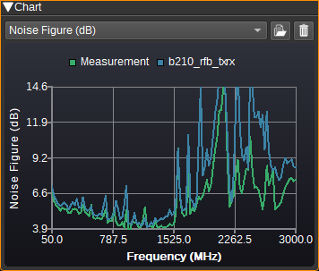
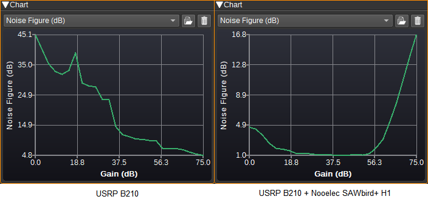

<h1>Noise Figure plugin</h1>

<h2>Introduction</h2>

This plugin can be used to calculate the noise figure (NF) of a receiver (SDR as well as optionally one or more LNAs). It uses the Y-factor method and requires a calibrated noise source.

The noise figure of a receiver is important, as it determines the noise floor: Noise floor (dBm) = 10\*log10(1000kT)+NF+10\*log10(BW)

The noise figure will vary with frequency and gain settings. Typically, the noise figure will increase with frequency and decrease with gain. When measuring noise figure, AGC should be disabled.

<h2>Interface</h2>

The top and bottom bars of the channel window are described [here](../../../sdrgui/channel/readme.md)

<h3>1: Measurement frequency shift from center</h3>

Use the wheels to adjust the measurement frequency in Hz from the center frequency of reception. Left click on a digit sets the cursor position at this digit. Right click on a digit sets all digits on the right to zero. This effectively floors value at the digit position. Wheels are moved with the mousewheel while pointing at the wheel or by selecting the wheel with the left mouse click and using the keyboard arrows. Pressing shift simultaneously moves digit by 5 and pressing control moves it by 2.

Many SDRs have a large DC offset, which can significantly interfere with the NF measurement, so this setting should be used to move the measurement frequency away from the radio's center frequency or any other spurs.

<h3>2: Channel power</h3>

Average total power in dB relative to a +/- 1.0 amplitude signal received in the measurement band.

<h3>3: Level meter in dB</h3>

  - top bar (green): average value
  - bottom bar (blue green): instantaneous peak value
  - tip vertical bar (bright green): peak hold value

<h3>4: FFT size</h3>

Determines the size (number of points) of the FFT used to measure noise power. Only a single output bin of the FFT is used, which is selected by (1).

<h3>5: BW</h3>

Displays the measurement bandwidth in Hz as determined by the FFT size (4) and the sample rate.

<h3>6: FFTs to average</h3>

Determines the number of FFTs that are used to measure the average noise power. Using more FFTs can improve accuracy, at the expense of increased measurement time.

<h3>7: Sweep setting</h3>

The device setting to sweep should be entered. Predefined values include "centerFrequency" and "gain", but it is possible to
enter any setting supported by the device (that is accessible via the Web API). Not all devices support the "gain" setting.

When "centerFrequency" is set, sweep ranges and values are in MHz. For all other settings, the values are used without any scaling.
Note that some device settings are scaled in the SDRangel GUI compared to the values in the Web API. For example, RTL SDR gain setting of
40.2 in the GUI, is 402 in the Web API.

<h3>8: Sweep range</h3>

Specifies the values of the setting (E.g. centerFrequency of gain) to measure the noise figure at.

When the sweep setting (7) is "centerFrequency":

* Range - Specify start frequency in MHz, stop frequency in MHz and the number of steps. 100, 200, 5, would measure at 100MHz, 125MHz, 150MHz, 175MHz and 200MHz.
* Step - Specify start frequency in MHz, stop frequency in MHz and the step frequency in MHz. 100, 200, 25, would measure at 100MHz, 125MHz, 150MHz, 175MHz and 200MHz.
* List - Specify a space or comma separated list of frequencies in MHz. "100 125 150 175 200", would measure at 100MHz, 125MHz, 150MHz, 175MHz and 200MHz.

For other settings:

* Range - Specify start value, stop value and the number of steps. 100, 200, 5, would measure at 100, 125, 150, 175 and 200.
* Step - Specify start value, stop value and the step. 100, 200, 25, would measure at 100, 125, 150, 175 and 200.
* List - Specify a space or comma separated list of values. "100 125 150 175 200", would measure at 100, 125, 150, 175 and 200.

<h3>9: Start/stop noise figure measurement</h3>

Starts or stops the noise figure measurement. When starting a new measurement, existing results are cleared.

<h3>10: Save results</h3>

Saves the results in the table to a .csv file.

<h3>11: Clear results</h3>

Clears the current results from the table and chart.

<h3>12: Open ENR dialog</h3>

Opens the ENR dialog to allow entering the Excess Noise Ratios (ENRs) for noise source. ENR specifies the difference in noise source power output in dB from when the source is powered off compared to when it is powered on.
This typically varies with frequency, so values should be entered for each calibrated frequency. When a measurement is attempted at a frequency for which a value is not specified, an interpolated value will be used.
You can choose between linear and barycentric rational interpolation, and the difference between the two is shown in the chart.

<h3>13: Open Noise Source Control dialog</h3>

Opens the noise source control dialog, to allow setting how the plugin turns the power to the noise source off and on. Two control methods are supported: A program or script can be run to turn the power on or off,
or the VISA library (if installed) can be used to send SCPI commands to a programmable power supply or other test equipment.

The delay setting determines how long after the noise source's power is turned on or off, before the noise figure measurement starts. This should be long enough to allow the noise source output to settle, but
not too long so that tests over a large number of frequencies take a long time to run. The ideal value will vary with the noise source and power supply.

<h3>14: Results Table</h3>

Displays measurement results.

* Frequency/gain - Frequency of the measurement in MHz, gain or other setting as per (7).
* NF - Calculated noise figure in dB.
* T - Calculated noise temperature in Kelvin with a reference temperature of 290K.
* Y - Measured Y factor in dB (difference in measured power when the noise source is on and off).
* ENR - Excess noise factor of the noise source in dB.
* Floor - Noise floor in dBm assuming 1Hz bandwidth at 290K.

<h3>15: Results Chart</h3>

Plots the results (NF, T or Y) vs frequency as a line chart.

<h3>16: Open reference data</h3>

A set of reference data in .csv format can be loaded for comparisons with the measurement results. The first column of the .csv file should contain frequency and the second the noise figure in dB. The first row should contain a header (E.g. "Frequency,NF" although the exact text is ignored).

<h3>16: Clear reference data</h3>

Clears the reference data, so the chart only plots the measured data.

<h2>Usage</h2>

A typical h/w setup for measuring the noise figure of a receiver is shown below:

A DC blocking capacitor at the output of the noise source for SDRs with a bias tee is recommended.

The noise source may be a device from the 346 family (E.g. Keysight 346B or NoiseCom NC346), but also can be a lower cost device that is supplied with accurate ENR calibration data.
(Inaccurate ENR values can significantly impact the calculated NF).
The ENR calibration data indicates the difference in power output when the noise source is powered off compared with when it is powered on. As the first setup step, this calibration data should
be entered in to the ENR dialog (12).

Next, we need to setup how the SDRangel powers on and off the noise source. This is set in the Noise Source Control Dialog (13).
For a 346 device, a programmable power supply outputting 28V would be used. Providing the VISA libraries are installed (see below), we can send SCPI commands to enable and disable the PSU's output.
As an example, for a Rigol DP832, we can set the channel 1 output to be 28V and enable it, with:

    :SOURCE1:VOLTage 28
    :OUTPut:STATe CH1,ON

And then disable it with:

    :OUTPut:STATe CH1,OFF

The final settings needed are the frequencies or gains to measure the NF at. This can be set with (7) and (8), to step through a range or a list of specific values.

To start the measurement, press (9).

<h2>Examples</h2>

Here is a plot comparing the measured noise figure for tuner 1 of a SDRplay Duo, compared to the [datasheet values](https://www.sdrplay.com/wp-content/uploads/2018/06/RSPDuo-Technical-Information-R1P1.pdf).

Here is a plot comparing measured values for a USRP B210 for the RF A RX2 port to measured values for the TX/RX port. As we can see, there is lower noise on the RX2 port:

Here is a plot comparing measured values for a Nooelec SMArTee XTR on its own, with a Nooelec Sawbird GOES LNA and with a Sawbird+ GOES LNA.
As can be seen, a LNA makes a massive difference (12dB+) to the overall NF, and allows low cost SDRs to get similar NFs to more expensive devices,
as the total NF is primarily determined by the LNA, if it has a decent amount of gain:

In these plots, gain is swept at a single frequency (1420MHz), firstly for a B210 on its own, and then a B210 with a Nooelec H1 LNA.
While the NF is lowest at maximum gain for the standalone B210, due to the high gain of the LNA, the lowest NF for the combined devices is actually
well below the maximum B210 gain setting.

<h2>VISA libraries</h2>

VISA libraries are available for Windows, Linux and MacOS from:

* [Keysight](https://www.keysight.com/us/en/lib/software-detail/computer-software/io-libraries-suite-downloads-2175637.html)
* [NI](https://www.ni.com/en-gb/support/downloads/drivers/download.ni-visa.html)
