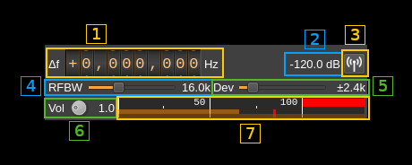
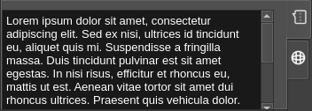
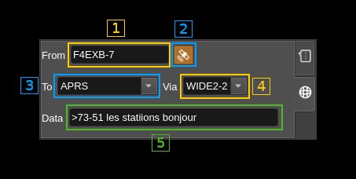
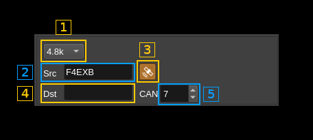

<h1>M17 modulator</h1>

<h2>Introduction</h2>

This plugin is available only on Linux.

This plugin encodes and modulates transmissions made in the [M17 protocol](https://spec.m17project.org/). M17 is a fully Open Source and Open Source audio codec based project (Codec2) for FM based digital voice amateur radio. More information is available [here](https://m17project.org/)

<h2>Main interface</h2>

There are 4 collapsible main sections in the GUI

  - **A: Settings**: General RF settings
  - **B: Audio**: Audio related settings
  - **C: Packet**: Packet mode related settings
  - **D: Digital**: Settings specific to digital

<h2>A: Settings</h2>

This is similar to what is found in the NFM modulator.

<h3>A.1: Frequency shift from center frequency of transmission</h3>

Use the wheels to adjust the frequency shift in Hz from the center frequency of transmission. Left click on a digit sets the cursor position at this digit. Right click on a digit sets all digits on the right to zero. This effectively floors value at the digit position. Wheels are moved with the mousewheel while pointing at the wheel or by selecting the wheel with the left mouse click and using the keyboard arrows. Pressing shift simultaneously moves digit by 5 and pressing control moves it by 2.

<h3>A.2: Channel power</h3>

Average total power in dB relative to a &plusmn;1.0 amplitude signal generated in the pass band.

<h3>A.3: Channel mute</h3>

Use this button to toggle mute for this channel.

<h3>A.4: RF bandwidth</h3>

This is the bandwidth in kHz of the channel signal filtered after modulation.

<h3>A.5: Frequency deviation</h3>

This is the peak FM deviation in ±kHz that will be effective for nominal (1.0) audio volume (FM analog) or extreme symbols (digital). As per M17 standard the value of &plusmn;2.4 kHz shall be used. However different values can be chosen for experimentation.

<h3>A.6: Volume</h3>

This is the volume of the audio signal from 0.0 (mute) to 2.0 (maximum). It can be varied continuously in 0.1 steps using the dial button.

<h3>A.7: Level meter in %</h3>

Shows the level of the modulating FM signal.

  - top bar (beige): average value
  - bottom bar (brown): instantaneous peak value
  - tip vertical bar (bright red): peak hold value

<h2>B: Audio</h2>

<h3>B.1: Tone input select</h3>

Works only in FM analog mode (B.3). Switches to audio tone input.

<h3>B.2: Tone frequency (kHz)</h3>

Adjusts the tone frequency from 0.1 to 2.5 kHz in 0.01 kHz steps

<h3>B.3: FM analog</h3>

Toggle analog modulation for audio (tone B.1, mic B.4 or file B.8 inputs). Used for testing purposes.

<h3>B.4: Mic (line in) input</h3>

Left click to switch to the audio input. You must switch it off to make other inputs available.

Right click to select audio input device. See [audio management documentation](../../../sdrgui/audio.md) for details.

<h3>B.5: Audio feedback</h3>

Activate or de-activate the input source audio feedback. The audio output device may be selected by right clicking on the button.

<h3>B.6: Audio feedback volume</h3>

Adjust audio feedback volume.

<h3>B.7: Audio file path</h3>

The path to the selected audio file to be played or dots if unselected

<h3>B.8: Audio file select</h3>

Opens a file dialog to select the audio file to be played. It must be mono 48 kHz F32LE raw format. Using sox a .wav file can be converted with this command: `sox piano.wav -t raw -r 48k -c 1 -b 32 -L -e float piano.raw`

<h3>B.9: Audio file loop</h3>

Play the audio file in an infinite loop

<h3>B.10: Play/pause file play</h3>

Toggle play/pause file play. When paused the slider below (B.13) can be used to randomly set the position in the file when re-starting.

<h3>B.11: Play file current position</h3>

This is the current audio file play position in time units relative to the start

<h3>B.12: Play file length</h3>

This is the audio file play length in time units

<h3>B.13: Play file position slider</h3>

This slider can be used to randomly set the current position in the file when file play is in pause state (button B.10)

<h2>C: Packet</h2>

<h3>C.1: Packet mode</h3>

Turn on packet mode. No other mode must be selected.

<h3>C.2: Initiate packet transmission</h3>

Send packet frames immediately

<h3>C.3: Send packets repeatedly</h3>

Send packet frames in an infinite loop with a delay between transmissions set by (C.4)

<h3>C.4: Delay between packets</h3>

Delay between packet frames in seconds when in loop mode (C.3)

<h3>C.5: BERT mode</h3>

This is a special mode for Bit Error Rate Testing. In this mode only a synchronization word followed by a chunk of bits taken from a pseudo random generator is sent for each frame. It can be selected only if no other mode is selected.

<h3>C.6: Packet tabbed panels</h3>

Panels corresponding to each available packet type are arranged in a tabbed setup. Tabs can be selected with icons on the right. These are:

  - **SMS**: SMS data with the chat icon. Selects SMS packet type.
  - **APRS**: APRS data with the world icon. Selects APRS packet type.

<h3>C.6.1: SMS data</h3>

Selected with the tab with chat icon (top most). Selecting this tab will set the packet mode to SMS.

This is simply a text edit window where you can type your SMS message. As per M17 standard the maximum number of characters is 798 and text will be truncated to this size if it is larger.

<h3>C.6.2: APRS data</h3>

Selected with the tab with word icon (bottom most). Selecting this tab will set the packet mode to APRS.

<h4>C.6.2.1: From identifier</h4>

This is the "FROM" of APRS message and usually is the station callsign followed by a dash and a numeric suffix.

<h4>C.6.2.2: Add location data</h4>

When toggled messages with data (C.6.2.5) and location payloads are sent alternatively. Location data (latitude and longitude) are taken from the global station position settings.

<h4>C.6.2.3: To identifier</h4>

This is the "TO" of APRS message. There is a choice between "APRS¨, "APZ¨, "CQ", "BEACON", "CALLSIGN-SSID" or custom.

<h4>C.6.2.4: Via identifier</h4>

This is the "VIA" of APRS message. There is a choice between "WIDE2-2", "ARISS" or custom.

<h4>C.6.2.5: Data payload</h4>

Arbitrary data payload to be added to the APRS message. As per APRS standard it must be prefixed with the `>` sign for text payloads.

<h2>D: Digital</h2>

<h3>D.1: Baud rate</h3>

Only the standard 4.8 kBaud rate is available. This is a provision for possible future experimentations.

<h3>D.2: Source call</h3>

This is the source callsign

<h3>D.3: Add GNSS data</h3>

Check this button to add GNSS data to the LSF (Link Setup Frame) data. Latitude, longitude and altitude are taken from the global station position settings.

<h3>D.4: Destination call</h3>

This is the destination callsign. Keep empty for a general (CQ or BROADCAST) call.

<h3>D.5: Channel Access Number</h3>

This is the 0..15 channel access number sent in the LSF (Link Setup Frame).
